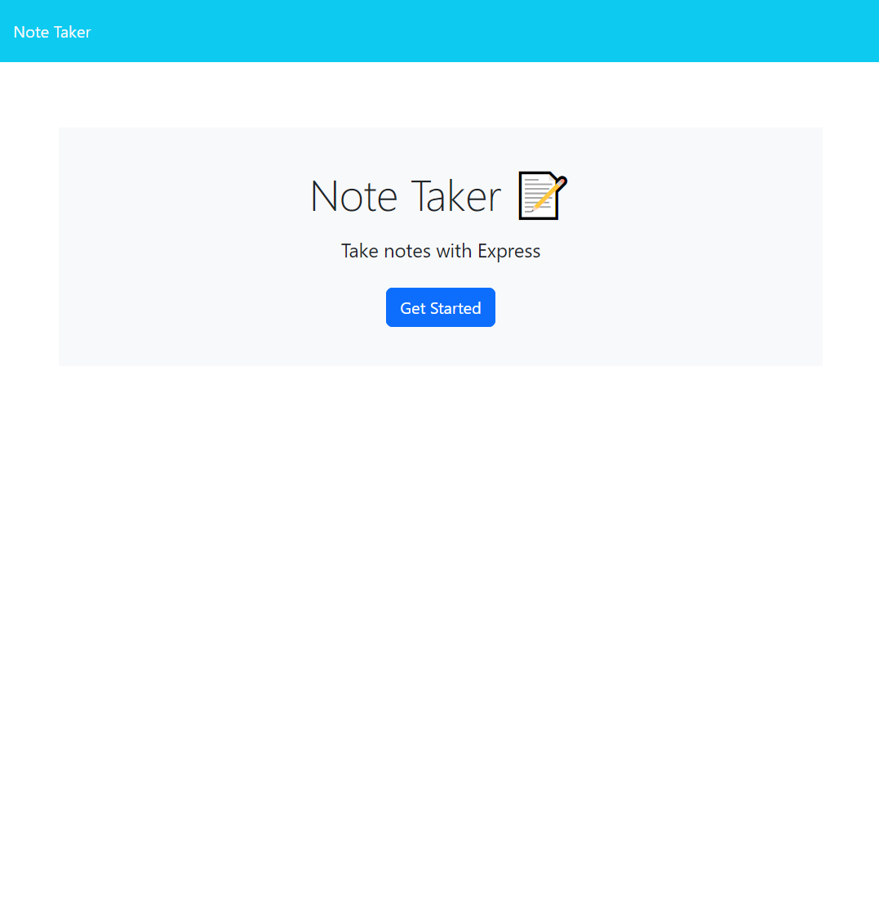
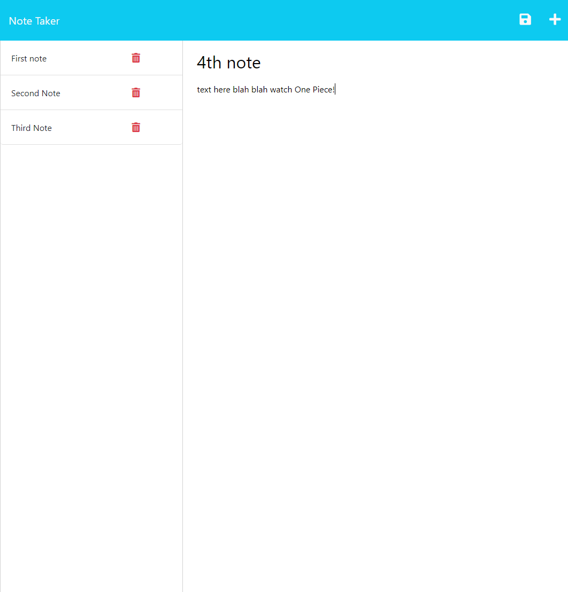
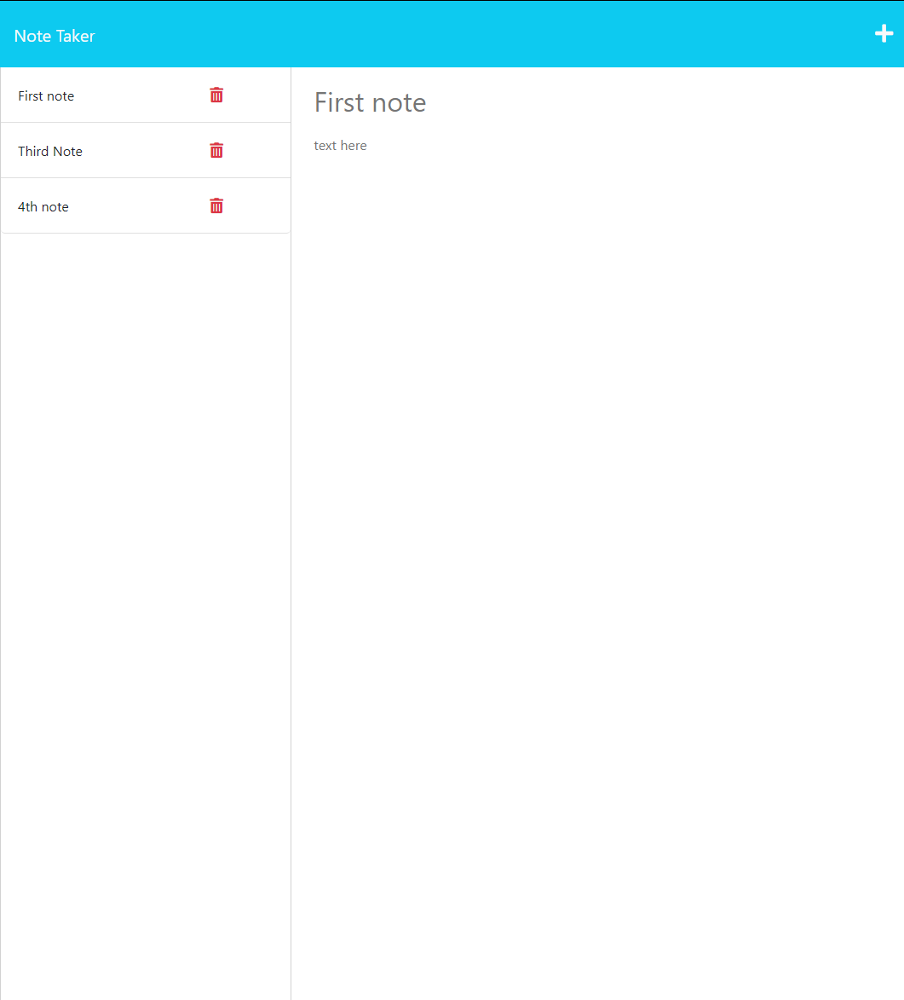

# Note Taker

## Description

This is a website where you can store notes and write anything you want to save. All your notes are saved locally in the file 'db.json'.

## Table of Contents

- [Installation](#installation)
- [Usage](#usage)
- [Preview](#preview)
- [Link](#link)
- [License](#license)
- [Questions](#questions)

## Installation

To install run the command 'npm i' to attain the correct node modules.

## Usage

To use this application, in your command line run the command 'node server.js' and a console log message will appear. Use ctrl+click to navigate to the sevrer and then write anything you want. To save your note, click the floppy disk icon. To create a new note click the plus sign. To delete a note click the trashcan icon.

## Preview

## Link

You must run the server in order to get full functionality but to see the deployed app --> [CLICK ME](https://jo3kr.github.io/Note-Taker/)

## Questions

For any questions, feel free to contact me on GitHub or by email:

- GitHub: [jo3kr](https://github.com/jo3kr)
- Email: joelmjohn16@gmail.com

## License

This project is licensed under the MIT license.

Copyright &copy; 2022 jo3kr &#127183;

